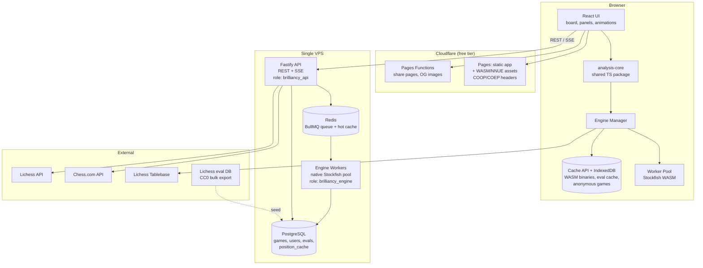

# Brilliancy — Technical Specification

**Version:** 1.1
**Date:** 9 September 2026
**Supersedes:** 1.0 (9 September 2026)
**Scope:** Hybrid-engine (browser WASM + server) chess analysis platform with accounts, multi-source game import, engine play, and board editor.

---

## 0. Changes in 1.1

Version 1.0 was directionally right and had fourteen places where it was silent, self-contradictory, or unimplementable. Each is now resolved and marked **[R-n]** at the point of resolution.

| | Problem in 1.0 | Resolution |
|---|---|---|
| R-1 | §5.5 mandated White-positive normalisation; §6.1 assumed side-to-move perspective. Both stated as law. | §5.6. White-positive everywhere, branded types, one conversion function. Side effect: the negation trick in §6.2 disappears. |
| R-2 | Classification presented as a single pure function, but three of its inputs depend on other plies. | §6.0. Four-pass pipeline, explicitly ordered. |
| R-3 | `isOnlyGoodMove` and `prevMoveWasError` used but never defined. | §6.4.1. Both defined numerically so neither depends on another ply's *label*. |
| R-4 | `-bestScore(position_{i+1})` is meaningless when position *i+1* is terminal. | §6.2.1. Explicit `TerminalScore`, and mate distance tracked in plies. |
| R-5 | `isMiss` runs before the loss ladder, so no move after an opponent error can ever be a Blunder. | §6.3.1. Kept, made deliberate, and a separate `lossBucket` is stored alongside the label. |
| R-6 | Browser-computed evals feeding a global shared cache is a poisoning vector. Never mentioned. | §3.3. Client evals never reach `position_cache`. Enforced at the Postgres role level. |
| R-7 | `position_cache` PK forced exact depth match, discarding most of the cache's value. | §8.3. Lookup is `depth >= requested`, PK unchanged. |
| R-8 | Exact halfmove clock in the cache key fragments the cache. | §8.2. Bucketed, and aligned with Lichess's normalisation so the CC0 eval database can seed the cache. |
| R-9 | §6.6 step 1 required chess.com Game Review labels, which are not legitimately obtainable. | §6.6. Ground truth is now Lichess NAGs plus a hand-labelled set. |
| R-10 | Anonymous-then-claim was P0 with no data model. | §8.5. Client-only storage, explicit claim endpoint. |
| R-11 | GDPR export and deletion were P0 with no endpoints. | §9.3. |
| R-12 | SEE and three companion primitives assumed to exist. They do not exist in chess.js. | §6.5.1. Own implementation, own board representation, own golden suite. |
| R-13 | Cross-origin isolation specified for production only; multi-threaded WASM would never work in dev. | §5.2.1. Also documents the Safari `credentialless` gap. |
| R-14 | No decision on test runner, linter, tsconfig, hashing library, ECO data, piece art, or CI. | §0.2. |

Two additions that are not fixes:

- **§3.4** — the Lichess open database publishes ~395 M Stockfish-evaluated positions under CC0. This can seed `position_cache` directly and changes the cold-start economics of the whole design.
- **§5.0** — Stockfish 19's release claims are verified. Checked against the upstream release notes and stockfishchess.org: released 2026-09-05, introduces SFNNv16, retires the secondary net from 16.1, adds native support for RISC-V, LoongArch and **WebAssembly targets**, gains up to 44 Elo over SF18, and overhauls the shared-memory implementation for Linux, macOS and BSD. Every SF19 claim in 1.0 holds.

---

## 0.1 Reading order

If you read nothing else before writing code: **§0.2, §2, §5.6, §6.0**. Those four decide things that are expensive to change later. Everything else is recoverable.

## 0.2 Fixed decisions [R-14]

Settled. Do not relitigate mid-build; if one turns out wrong, change it in a decision record (§16) and note the version.

| Area | Decision |
|---|---|
| Licence | AGPL-3.0-or-later for the whole repository. `LICENSE` and `NOTICES` land in the first commit. |
| Runtime | Node 22 LTS. Pinned in `.nvmrc` and `engines`. |
| Package manager | pnpm 9, pinned via `packageManager` in the root `package.json`. |
| Monorepo | pnpm workspaces + Turborepo, created at Phase 0 even though only two packages exist. |
| TypeScript | `strict: true`, `noUncheckedIndexedAccess: true`, `exactOptionalPropertyTypes: true`, `verbatimModuleSyntax: true`. Target ES2022, `moduleResolution: "bundler"`. |
| Lint + format | Biome. One tool, one config, no ESLint/Prettier boundary disputes. |
| Unit + integration tests | Vitest. Browser-context tests via `@vitest/browser` where a Web Worker is genuinely needed. |
| E2E | Playwright, Chromium + WebKit. WebKit specifically because of §5.2.1. |
| Hashing | `@noble/hashes/blake3`. Pure TypeScript, byte-identical in browser and Node, no native addon, no WASM initialisation dance. Cache keys must match across tiers or the whole cache is worthless. |
| ECO / opening data | `lichess-org/chess-openings` — a curated aggregation of ~3,700 opening names released under CC0, distributed as five TSV files by ECO volume. Vendored at a pinned commit into `packages/openings`, not fetched at build time. |
| Piece art | Cburnett (CC-BY-SA 3.0, Wikimedia) as the default set, plus at least one alternative. Bundled as static SVG assets, not linked into the program — aggregation, not a derivative work, so the CC-BY-SA/AGPL question does not arise. Attribution goes in `NOTICES` and in the in-app theme picker. |
| Classification icons | Original SVG, drawn in-repo. Never derived from chess.com artwork. See §2.4. |
| Board renderer | `@lichess-org/chessground`, pinned. See §4.3. |
| CI | GitHub Actions. The performance assertion in §13 runs on `ubuntu-latest` with a fixed engine build and a generous budget — it is a regression alarm, not a benchmark. |
| Commits | Conventional Commits. Feature branches off `main`, PR per branch, **merge commits — no squashing**. Every commit on a feature branch should stand on its own. |
| Decision records | `docs/decisions/NNNN-title.md`. See §16. |

---

## 1. Feasibility and cost

### 1.1 Verdict

Buildable by one developer on a hosting-plus-domain budget. Nothing in the scope requires paid APIs, paid models, or licensed data.

The reason it works: Stockfish runs in the browser via WebAssembly at genuine full strength. Your users' CPUs do the expensive work. The server tier exists only for deep runs and for building a shared evaluation cache — and that cache is what keeps server cost near-flat as you grow, because chess positions repeat enormously across games.

Stockfish 19's upstream WebAssembly targets mean you are no longer dependent on a third-party port staying current. That is a structural change in this project's favour, and it arrived four days before this spec was written.

### 1.2 Running cost

| Item | Provider | Monthly |
|---|---|---|
| Domain | Cloudflare Registrar / Porkbun | ~$1 (≈$10–14/yr) |
| Static frontend + CDN | Cloudflare Pages (free tier) | $0 |
| WASM/NNUE asset egress | Cloudflare CDN (free tier) | $0 |
| VPS: API + Postgres + Redis + engine workers | Hetzner / Netcup / OVH | €6–20 |
| Object storage (PGN archives, OG images, GDPR exports) | Cloudflare R2 free tier (10 GB) | $0 |
| Transactional email | Resend / Postmark free tier | $0 |
| Error tracking | Sentry / GlitchTip self-hosted | $0 |
| **Total** | | **≈ $8–25/mo** |

Note on VPS pricing: Hetzner raised cloud prices twice in 2026 — on 1 April and again on 15 June, with shared-vCPU plans rising roughly 1.3–1.4x and dedicated-vCPU CPX/CCX families rising 2.1–3.1x, and plan names changed (CX22/CX32 became CX23/CX33). Availability of the cheapest shared tiers has been intermittent. Price this at order time and treat Netcup, OVH, and Contabo as live alternatives — for this workload you want cheap sustained CPU, not managed anything.

### 1.3 The three cost traps

1. **WASM payload.** The full multi-threaded NNUE build was around 75 MB for Stockfish 18. SFNNv16 removed redundant threat features and reduced binary size, so re-measure against SF19 rather than trusting that number. Whatever it comes to: serve it from a CDN with immutable cache headers and store it client-side in the Cache API so it downloads once per user, ever. Default new visitors to the lite build.
2. **Server engine abuse.** An unauthenticated "analyze at depth 30" endpoint is a free CPU faucet. Deep analysis must be auth-gated, queued, and quota'd from day one.
3. **Unbounded PGN storage.** Batch imports of 20,000-game archives will fill a 40 GB disk. Compress PGN at rest, cap per-user storage, and store move evaluations rather than re-storing positions.

---

## 2. Licensing — read this before writing code

This section is load-bearing. Getting it wrong is the single most likely way this project ends badly.

### 2.1 Stockfish is GPL-3.0-or-later

Stockfish is licensed GPL-3.0-or-later. The Stockfish project has enforced this against commercial vendors before. If you ship Stockfish — as a WASM bundle to the browser, or as a native binary in your Docker image — the combined work is a derivative work under the FSF's reading.

### 2.2 Chessground is GPL-3.0 too, and explicitly says so for websites

Lichess's board renderer states the position directly: its README states that Chessground is distributed under GPL-3.0-or-later, that using it for your website makes the combined work distributable only under the GPL, and that you must therefore release your source code to the users of your website. The `@lichess-org/stockfish-web` package is AGPL-3.0-or-later.

### 2.3 What to do

**License the entire project AGPL-3.0-or-later.** You want it open source anyway, so this costs you nothing and resolves every question above. It is what Lichess does. AGPL over plain GPL because it closes the "network use isn't distribution" gap, which matters for a hosted web app.

Practical consequences to accept up front:
- You cannot later relicense to build a closed-source commercial version without rewriting the GPL parts.
- Anyone can fork and host your analyzer. This is fine; it is how Lichess-adjacent tools thrive.
- Keep a `NOTICES` file listing Stockfish, Chessground, chess.js, opening data, and piece art with their licenses. Update it in the same commit that adds the dependency, never later.

### 2.4 Assets you must not copy

| Asset | Status | Do this instead |
|---|---|---|
| Chess.com move-quality icons (Brilliant `!!`, Great `!`, etc.) | Copyrighted artwork | Draw your own. The *concept* of grading moves is not protectable; the specific glyphs are. |
| Chess.com piece sets, board themes, sounds | Proprietary | Cburnett (§0.2), or commission/draw your own. |
| Chess.com's exact classification thresholds | Undisclosed | Derive your own from win-probability. §6 shows how. |
| Chess.com Game Review classification labels | Behind authentication; scraping them breaches the ToS | Do not. §6.6 uses a different ground truth. [R-9] |
| The name/branding | Trademarked | Don't imply affiliation. "Chess.com-style" in your README is fine; "Chess.com Analyzer" is not. Brilliancy is a chess term predating chess.com's "Brilliant" label by a century, so the name itself is safe — but keep comparative marketing factual and never suggest endorsement. |

Chess.com's public data API is read-only and requires no key, but rate-limit yourself and identify your client honestly in the User-Agent. Lichess's API is generous but expects you to respect its documented limits and not mirror its database wholesale — note that the bulk exports at `database.lichess.org` are the sanctioned way to get data in volume, and they are CC0.

### 2.5 Third-party data you may use freely

| Source | Licence | Use |
|---|---|---|
| `lichess-org/chess-openings` | CC0 | ECO codes and opening names (§0.2) |
| Lichess evaluation database | CC0 | Seeding `position_cache` (§3.4) |
| Lichess puzzle database | CC0 | Optional puzzle seed set, P3 |
| Cburnett piece set | CC-BY-SA 3.0 | Default piece art, attributed |

---

## 3. System architecture



### 3.1 The core principle: cache-first, client-first

Every evaluation request follows this path:

1. **In-memory map** for the current session — instant.
2. **IndexedDB** local cache — instant, survives reload.
3. **Server position cache** (`GET /api/eval/batch`) — one round trip, covers positions the server has analyzed or been seeded with. Opening positions hit this constantly.
4. **Local WASM engine** — seconds, free.
5. **Server engine queue** — only for explicit deep runs.

Steps 1–4 cost you nothing. Step 5 is the only one that consumes your budget, and it is opt-in and quota'd.

The shared position cache is the highest-leverage thing in this design. Analysis is deterministic given (position, engine version, depth, MultiPV, thread count). Every position analyzed at a canonical depth is stored once and served to everyone forever.

### 3.2 Why hybrid, concretely

| | Browser WASM | Server native |
|---|---|---|
| Cost to you | Zero | CPU-seconds |
| Speed | ~1–3 Mnps multi-threaded desktop; far less on mobile | 5–15 Mnps on modest VPS cores |
| Latency to first eval | ~0 after warm cache | Queue wait + network |
| Works offline | Yes | No |
| Consistent across users | No — depends on their device | Yes |
| Trustworthy for shared cache | **No** (§3.3) | Yes |
| Good for | Interactive board, full-game sweep at depth 16–20 | Depth 25+, correspondence-grade, cache seeding |

Default everything to the client. Offer the server tier as a labelled "Deep analysis" action with a visible queue position.

### 3.3 Cache trust boundary [R-6]

**A browser-computed evaluation must never be served to a different user.**

The shared cache is the cost-control mechanism, which makes it the highest-value thing to poison. A hostile client can POST arbitrary `(fen, score, pv)` tuples. If those enter `position_cache`, every subsequent user is served a fabricated evaluation for that position, permanently, with no signal that anything is wrong. Silent, durable, and attributable to you.

The rule and its enforcement:

- `POST /api/eval/batch` is **read-only**. There is no endpoint, at any tier, that accepts a client-supplied evaluation into `position_cache`. Not for authenticated users, not for the developer's own account.
- Client-computed evals are still persisted — into `move_evals`, scoped to one `analyses` row with `tier = 'client'`, visible only to that game's owner. This is what makes a client-side analysis survive a reload and appear in the library.
- Enforcement is at the database, not in application logic. Two Postgres roles: `brilliancy_api` has no `INSERT`/`UPDATE` grant on `position_cache`; `brilliancy_engine` does. A future code change that "helpfully" writes client evals to the cache fails at the SQL layer instead of shipping.
- The `engine-worker` writes to `position_cache` only for jobs it executed itself.

If you later want client compute to contribute — and at scale it is tempting, because it is how Lichess built its eval database — do it through a quarantine table, not by relaxing this:

```sql
position_cache_candidates(
  fen_hash, engine_version, depth, multipv,
  score_cp, score_mate, pv jsonb,
  submitted_by, submitted_at,
  PRIMARY KEY (fen_hash, engine_version, depth, multipv, submitted_by)
)
```

Promote to `position_cache` only when *k* independent accounts (k ≥ 3, no shared IP, accounts older than 30 days) submit a best move that agrees and a score within 15 cp. Ship this only when you have the user volume to make k achievable, and never before you have per-account submission rate limits. Until then, it is a P3 idea, not a plan.

### 3.4 Seeding the cache from the Lichess database

The Lichess open database publishes roughly 395 million Stockfish-evaluated positions under CC0 — produced by the Lichess analysis board running Stockfish inside user browsers — as one JSON object per line, each carrying knodes searched, depth reached, and a list of principal variations.

This is a legitimate, licence-clean way to give `position_cache` a warm start covering essentially every opening and a large slice of common middlegame positions — on day one, before you have a single user.

Constraints to respect:

- The full set will not fit on a €6 VPS. Filter on ingest: take positions with `depth >= 20` and at least 3 PVs, and cap total rows at whatever leaves 60% of your disk free. Prioritise by piece count descending (openings and early middlegames repeat most).
- Their FEN carries only pieces, active colour, castling rights, and en passant square — no halfmove clock. §8.2's bucketing is designed to make your hash agree with theirs for the overwhelming majority of positions, which is what makes this seeding possible at all. Do not change the hash without re-checking this.
- Their evaluations come from a mix of Stockfish versions, which your `engine_version` cache key dimension is not able to represent. Ingest them under the reserved sentinel `engine_version = 'lichess-db'`, and rank it below your own entries in the §8.3 lookup — so a seeded value is used when nothing better exists, and superseded the moment your own engine produces one.
- Ingest is a one-off script in `tools/seed-cache/`, run manually against a downloaded shard. It is not part of the deployment.

This is Phase 5 work. It is listed here because the *hash design in Phase 1* has to be compatible with it, and that is the kind of thing that is free to get right now and expensive to retrofit.

---

## 4. Technology stack

### 4.0 Settled elsewhere

Language, runtime, package manager, linter, test runners, tsconfig, hashing, ECO data and piece art are fixed in §0.2. This section covers only choices with genuine trade-offs remaining.

### 4.1 Recommendation summary

| Layer | Choice | Why this one |
|---|---|---|
| Language | TypeScript everywhere | The classification logic must run identically in browser and on server. Write it once, share it. This single fact drives the whole stack decision. |
| Frontend | React 19 + Vite | The app is client-heavy and stateful. Static output deploys free to Cloudflare Pages and takes zero load off your VPS. |
| Board | `@lichess-org/chessground` | See 4.3. |
| Chess rules | `chess.js` | Move gen, SAN/FEN/PGN, legality. Battle-tested. Not used for SEE — see §6.5.1. |
| State | Zustand + TanStack Query | Zustand for board/engine state (frequent updates, no provider hell), TanStack Query for server state. Redux is overkill. |
| Styling | Tailwind CSS v4 + CSS custom properties | Board themes need runtime-swappable variables; Tailwind handles everything else. |
| Animation | CSS transforms + Motion (`motion/react`) for panels | Piece movement must be CSS transform + `will-change`, not a JS animation library — see 7.3. |
| Charts | Custom SVG, or `visx` | The eval graph needs click-to-seek and hover-scrub; generic chart libs fight you on this. |
| Backend | Node 22 + Fastify | Fastify over Express for schema validation, speed, and native SSE-friendliness. |
| ORM | Drizzle | Thin, real SQL, tiny runtime footprint. Prisma's engine binary is a poor fit for a small VPS. Also: §3.3's role separation is expressed in SQL migrations, which Drizzle does not hide from you. |
| Database | PostgreSQL 17 | JSONB for PV lines, good indexing, one dependency. |
| Queue + cache | Redis + BullMQ | Mature, observable, handles the engine job queue and rate limits. |
| Auth | Better Auth | Sessions, OAuth, email verification, TypeScript-native, self-hostable. Auth.js is the alternative. |
| Engine workers | Node process supervisor spawning native Stockfish | See 5.4. Go/Rust is a valid swap if this becomes a bottleneck; it will not at your scale. |
| Reverse proxy | Caddy | Automatic TLS, trivial config. |
| Deploy | Docker Compose on one VPS | Do not reach for Kubernetes. |

### 4.2 Repository layout

```
brilliancy/
├─ apps/
│  ├─ web/                    # Vite + React SPA
│  ├─ api/                    # Fastify REST + SSE
│  └─ engine-worker/          # BullMQ consumer, native Stockfish pool
├─ packages/                  # published under the @brilliancy/* scope
│  ├─ analysis-core/          # ⭐ classification, win%, accuracy, reports
│  ├─ engine-protocol/        # UCI encode/parse, Score types — shared client & server
│  ├─ chess-utils/            # PGN normalise, FEN hash, own board repr, SEE, material
│  ├─ openings/               # vendored ECO TSV + lookup trie
│  └─ db/                     # Drizzle schema, migrations, role grants
├─ infra/
│  ├─ docker-compose.yml
│  ├─ Caddyfile
│  └─ stockfish/Dockerfile    # builds native SF19 from source
├─ tools/
│  ├─ calibrate/              # threshold tuning harness (§6.6)
│  └─ seed-cache/             # Lichess CC0 eval DB ingest (§3.4)
└─ docs/
   ├─ decisions/              # NNNN-title.md (§16)
   └─ grading.md              # source for the public "how we grade moves" page
```

`@brilliancy/analysis-core` is the heart of the project. It must be pure, synchronous, and dependency-light so it runs unchanged in a Web Worker and in Node. Its only workspace dependencies are `engine-protocol` and `chess-utils`, and neither may import from `analysis-core` — the dependency graph among packages stays acyclic and shallow.

### 4.3 Board library decision

| | `react-chessboard` v5 | Chessground |
|---|---|---|
| License | MIT | GPL-3.0-or-later |
| React integration | Native | Wrapper needed |
| Rendering | React + dnd-kit | Custom DOM diff, extremely fast |
| Animation quality | Good | Excellent — purpose-built for this |
| Arrows/circles | Basic | Full annotation support built in |
| Mobile touch | Good | Excellent |

**Chessground, from `@lichess-org/chessground`.** You are already GPL because of Stockfish, so its licence costs nothing extra, and it is the only board renderer in the ecosystem genuinely built for analysis UI — arrows, circles, drag ghosts, and DOM diffing that lets you re-render on every engine tick without jank.

Packaging, since 1.0 left this open: the **unscoped `chessground` package on npm is deprecated** and stalled at 9.2.x; its npm page carries a "no longer supported" notice. The scoped **`@lichess-org/chessground`** is the live, maintained publication from the Lichess repo (9.8.x as of mid-2026). Use the scoped package, pin the exact version, and treat upgrades as deliberate changes with a visual regression pass — Chessground's API is stable but its CSS contract is not something you want changing under you silently.

Write a thin React wrapper yourself (`apps/web/src/board/Chessground.tsx`, ~150 lines): imperative `Chessground(el, config)` on mount, `api.set(diff)` on prop change, `api.destroy()` on unmount, and a `ref` escape hatch for arrows and shapes. The community wrappers exist but are thin enough that owning it costs less than depending on it.

---

## 5. Engine layer

### 5.0 Stockfish 19 status

Verified as of this revision. The important consequence for this project is that **WebAssembly is now an upstream build target**, so `infra/stockfish/Dockerfile` and the browser artifact pipeline can build from the same source tree at the same tag. You are no longer waiting on a third-party port.

Two knock-on effects on 1.0's numbers:

- SFNNv16 reduced binary size by removing redundant threat features and retired the 16.1 secondary net. The ~75 MB figure in §5.1 came from the SF18 era. **Measure your own artifacts** before writing the size into any UI copy.
- SF18 introduced shared memory for NNUE weights across processes; SF19 overhauled it for Linux/macOS/BSD. §5.4's multi-instance memory maths depends on this, so build SF19 with it enabled and verify with `ps` that RSS does not scale linearly with instance count.

### 5.1 Client build tiers

Ship five builds and select at runtime. Sizes are SF18-era estimates pending measurement:

| Tier | Build | Size | Requires | Strength |
|---|---|---|---|---|
| 1 | Large multi-threaded NNUE | ~75 MB | Cross-origin isolation + SharedArrayBuffer | Full |
| 2 | Large single-threaded NNUE | ~75 MB | WASM + SIMD | Full, slower |
| 3 | Lite multi-threaded | ~7 MB | Cross-origin isolation | Slightly weaker net |
| 4 | Lite single-threaded | ~7 MB | WASM | Slightly weaker net |
| 5 | asm.js fallback | ~10 MB | Any JS | Very weak, last resort |

Sources, in order of preference:
1. **Stockfish 19 upstream WASM targets** — now official; build from source and control your own artifacts.
2. **`stockfish.js`** (nmrugg / LabinatorSolutions fork) — packages exactly these five flavours with a simple worker API. Fastest path to a working prototype.
3. **`@lichess-org/stockfish-web`** — strongest and most current, but its README warns it is tuned for Lichess's needs and not straightforward to load. Use once you know what you're doing.

Start on `stockfish.js` for the prototype. Move to self-built SF19 artifacts before launch.

The engine artifact must be addressed by a version string that ends up in `analyses.engine_version` and in every cache key. Format: `sf19-{tier}-{buildHash8}`. Never ship two different binaries under one version string; that silently corrupts the cache in a way you will not be able to unpick afterwards.

### 5.2 Cross-origin isolation

Multi-threaded WASM needs `SharedArrayBuffer`, which browsers only expose on cross-origin-isolated pages. Set on every HTML response:

```
Cross-Origin-Opener-Policy: same-origin
Cross-Origin-Embedder-Policy: credentialless
Cross-Origin-Resource-Policy: same-origin
```

Use `credentialless`, not `require-corp`. `require-corp` demands CORP headers on every cross-origin subresource and will silently break OAuth popups, embedded videos, and third-party avatars. `credentialless` loads cross-origin resources without credentials instead, which is almost always what you want.

On Cloudflare Pages this is a `_headers` file at the project root:

```
/*
  Cross-Origin-Opener-Policy: same-origin
  Cross-Origin-Embedder-Policy: credentialless

/engine/*
  Cache-Control: public, max-age=31536000, immutable
  Cross-Origin-Resource-Policy: same-origin
```

### 5.2.1 Isolation in development, and the Safari gap [R-13]

1.0 specified isolation for production only. Vite's dev server sends none of these headers by default, so `crossOriginIsolated` is `false` on `localhost`, `SharedArrayBuffer` is undefined, and the tier detector silently drops you to single-threaded. You then spend a day debugging thread performance that was never enabled. Set it in `vite.config.ts` for **both** `server` and `preview`:

```ts
const coi = {
  'Cross-Origin-Opener-Policy': 'same-origin',
  'Cross-Origin-Embedder-Policy': 'credentialless',
};

export default defineConfig({
  server:  { headers: coi },
  preview: { headers: coi },
});
```

Add a dev-only assertion that logs loudly when `crossOriginIsolated === false` on `localhost`, so a config regression is noticed in seconds rather than in a profiling session.

**Safari does not support `COEP: credentialless`.** It honours `require-corp` only. So on Safari — desktop and every iOS browser, since they all use WebKit — `crossOriginIsolated` will be `false` under this configuration and every Safari user gets a single-threaded tier. This is a deliberate trade: `require-corp` would buy Safari threading at the cost of breaking OAuth popups and third-party images for everyone. Single-threaded WASM on Safari is an acceptable outcome; a broken login flow is not.

Consequences to build around:
- The tier detector must reach 'lite-st' or 'large-st' on Safari without erroring. It already does, via the `crossOriginIsolated` check.
- Playwright's WebKit project exists in the E2E suite specifically to assert that the app loads, detects a single-threaded tier, and analyses successfully with no console errors.
- The engine settings UI must not present multi-threaded tiers as selectable when `crossOriginIsolated` is false. Show them disabled with a one-line reason rather than hiding them, or Safari users will report the setting as missing.
- Revisit if WebKit ships `credentialless`; that is a decision record, not a silent flag flip.

### 5.2.2 Tier detection

```ts
export function detectEngineTier(): EngineTier {
  const wasm = typeof WebAssembly === 'object'
    && WebAssembly.validate(Uint8Array.of(0,97,115,109,1,0,0,0));
  if (!wasm) return 'asmjs';

  const threads = typeof SharedArrayBuffer !== 'undefined'
    && globalThis.crossOriginIsolated === true;

  const simd = WebAssembly.validate(Uint8Array.of(
    0,97,115,109,1,0,0,0,1,5,1,96,0,1,123,3,2,1,0,10,10,1,8,0,65,0,253,15,253,98,11
  ));

  const mem = (navigator as any).deviceMemory ?? 4;
  const mobile = /Android|iPhone|iPad/i.test(navigator.userAgent);
  const big = mem >= 8 && !mobile;

  if (threads && simd && big) return 'large-mt';
  if (threads && simd)        return 'lite-mt';
  if (simd && big)            return 'large-st';
  if (simd)                   return 'lite-st';
  return 'asmjs';
}
```

Let users override the auto-choice in settings, and persist it. Power users on desktop will want the large build permanently.

### 5.3 Client worker pool — the important subtlety

**Batch full-game analysis and interactive single-position analysis want opposite thread configurations.**

- **Interactive** (user is sitting on one position, watching the eval refine): one engine instance with `Threads = N`. Lazy SMP gives you deeper search on that one position.
- **Batch** (analyzing 80 plies of a game): `N` *separate single-threaded* engine instances, one position each. Independent positions are embarrassingly parallel, and parallel single-threaded search beats one multi-threaded search on aggregate throughput by a wide margin, because Lazy SMP scales sublinearly.

Getting this wrong makes full-game analysis 2–3x slower than it should be.

```ts
const cores = navigator.hardwareConcurrency ?? 4;

const batchPool = {
  instances: Math.max(1, Math.min(Math.floor(cores / 2), 6)),
  threadsEach: 1,
  hashMb: isMobile ? 16 : 64,
};

const interactive = {
  instances: 1,
  threadsEach: Math.max(1, Math.min(cores - 1, 8)),
  hashMb: isMobile ? 32 : 256,
};
```

Cap hash hard on iOS. Safari kills WASM modules that allocate aggressively, and a 512 MB hash will get your tab reaped mid-analysis with no useful error.

### 5.4 Server engine pool

The `engine-worker` app maintains long-lived Stockfish child processes rather than spawning per job — process startup plus NNUE load is expensive.

```ts
class EnginePool {
  private idle: UciEngine[] = [];
  private busy = new Set<UciEngine>();

  async acquire(): Promise<UciEngine> { /* wait on semaphore */ }

  async analyse(job: AnalysisJob): Promise<PositionEval> {
    const e = await this.acquire();
    try {
      await e.send('ucinewgame');           // clear TT between unrelated positions
      await e.send(`setoption name MultiPV value ${job.multipv}`);
      await e.send(`position fen ${job.fen}`);
      return await e.go({ depth: job.depth, onInfo: job.onInfo });
    } finally {
      this.release(e);
    }
  }
}
```

Sizing on a 4-vCPU VPS: 3 instances × 1 thread × 128 MB hash. Leave a core for Postgres, Redis, and the API. Set `nice`/`cpulimit` on engine processes so a long queue never starves the API.

The engine worker is the only component that writes `position_cache` (§3.3), and it does so only for results it produced itself, keyed by its own `engine_version`.

### 5.5 UCI parsing

`info` lines are the only thing that matters. Parse defensively — field order is not guaranteed and Stockfish emits partial lines constantly. Note that SF19 tightened validation of FEN strings and UCI commands, so malformed input now fails earlier and louder; treat any parse rejection as a bug in your emitter, not noise to swallow.

```ts
// info depth 22 seldepth 30 multipv 1 score cp 34 nodes 1204331 nps 1500000
//   time 803 pv e2e4 e7e5 g1f3 ...
export function parseInfo(line: string): RawInfoLine | null {
  if (!line.startsWith('info ')) return null;
  const t = line.split(' ');
  const out: Partial<RawInfoLine> = {};
  for (let i = 1; i < t.length; i++) {
    switch (t[i]) {
      case 'depth':    out.depth = +t[++i]!; break;
      case 'seldepth': out.seldepth = +t[++i]!; break;
      case 'multipv':  out.multipv = +t[++i]!; break;
      case 'nodes':    out.nodes = +t[++i]!; break;
      case 'nps':      out.nps = +t[++i]!; break;
      case 'time':     out.timeMs = +t[++i]!; break;
      case 'score':
        if (t[i+1] === 'cp')        { out.rawCp = +t[i+2]!; i += 2; }
        else if (t[i+1] === 'mate') { out.rawMateMoves = +t[i+2]!; i += 2; }
        break;
      case 'pv':       out.pv = t.slice(i + 1); i = t.length; break;
    }
  }
  return out.depth != null ? (out as RawInfoLine) : null;
}
```

`RawInfoLine` carries `rawCp` / `rawMateMoves` — engine-perspective, deliberately named so they cannot be confused with a normalised score. They are converted exactly once, at the boundary described next, and the raw type never escapes `@brilliancy/engine-protocol`.

### 5.6 Sign convention — the one law [R-1]

Version 1.0 contained two incompatible rules: §5.5 said normalise to White-positive at the parser boundary, §6.1 said win% takes a side-to-move score. Both were stated as requirements. This is the single most common source of bugs in analysis tools and it needs to be settled by the type system, not by discipline.

**The law: every score that is stored, transported, cached, or logged is White-positive. Mover-perspective exists only inside `analysis-core`, only for the duration of one classification, and is produced by exactly one function.**

```ts
// packages/engine-protocol/src/score.ts

/** Positive = good for White. The only score type that may cross a boundary. */
export type WhiteScore =
  | { readonly kind: 'cp';   readonly cp: number }
  | { readonly kind: 'mate'; readonly plies: number }   // signed; >0 = White mates
  | { readonly kind: 'terminal'; readonly outcome: 'white' | 'black' | 'draw' };

/** Positive = good for whoever is to move. Never persisted, never sent over the wire. */
export type MoverScore = WhiteScore & { readonly __mover: unique symbol };

/** The ONLY place a sign flip is permitted in this codebase. */
export function toMover(s: WhiteScore, sideToMove: 'w' | 'b'): MoverScore;

/** Parser boundary: raw engine output -> White-positive, immediately. */
export function normaliseInfo(raw: RawInfoLine, sideToMove: 'w' | 'b'): InfoLine;
```

Rules that follow, and that lint/review should enforce:

1. `normaliseInfo` is called at the moment a line leaves the UCI reader. `RawInfoLine` is not exported from the package.
2. Mate is stored **in signed plies**, not in moves. UCI reports `mate n` in *moves* from the side to move; convert with `plies = n > 0 ? 2n - 1 : 2n`, then apply the White-positive sign. The asymmetry is real and is the reason for storing plies at all: mating in `n` takes `2n-1` plies (you move last), being mated in `n` takes `2n` (the opponent moves last). Storing moves invites off-by-one bugs at every re-basing point and makes `mate 1` and `mate -1` look symmetric when they are not. Only the sign is consumed today — `winPercent` reads nothing else — so treat the magnitude as forward-compatibility, and unit-test both branches at `n = ±1` and `n = ±2`.
3. `winPercent` accepts `MoverScore` only. The compiler refuses a `WhiteScore`. This is the guard that makes the 1.0 contradiction unrepresentable.
4. The eval bar, the eval graph, `move_evals.score_cp`, `position_cache.score_cp` and the API are all White-positive. No component outside `analysis-core` ever sees a mover-relative number.
5. Unit tests must include asymmetric positions where the two conventions disagree in sign, asserted at every boundary: parse, cache round-trip, API round-trip, render.

**The payoff.** With this convention, §6.2's negation trick disappears entirely:

```
evalBefore(i)      = bestScore(position_i)        // White-positive
evalAfterPlayed(i) = bestScore(position_{i+1})    // White-positive — no negation
```

There is nothing to negate, because both are already in the same frame. The perspective flip happens once, later, inside `classify`, via `toMover(score, sideToMoveAt_i)`. One conversion, one place, one test.

Mate distances are always relative to the position at which they were computed, and are never re-based across plies — win% depends only on the sign, and nothing else in the pipeline reads the magnitude. If you later add "mate in 3 became mate in 9" as a quality signal, that is a new field, not a re-basing of this one.

---

## 6. Move classification — the core algorithm

This is what makes the product feel like chess.com rather than a generic engine viewer. It is also the part most implementations get wrong.

### 6.0 The pipeline [R-2]

Version 1.0 presented `classify()` as a pure function of one ply. Three of its inputs — `inBook`, `prevMoveWasError`, `phase` — cannot be computed from one ply alone, and one of them appears to depend on another ply's *label*, which would make the whole thing order-dependent and impossible to parallelise. It isn't, but only if you structure it deliberately.

**Four passes. Each depends only on the passes before it.**

| Pass | Name | Input | Output | Engine? | Parallel? |
|---|---|---|---|---|---|
| 0 | **Replay** | PGN or FEN + moves | Per-ply static facts | No | Sequential (it's a replay) |
| 1 | **Sweep** | Positions 0..N | `WhiteScore` + MultiPV per position | Yes | Fully — this is where the worker pool earns its keep |
| 2 | **Context** | Passes 0 + 1 | `ClassifyContext` per ply | No | Fully |
| 3 | **Classify** | Pass 2 | One label per ply | No | Fully |
| 4 | **Report** | Passes 2 + 3 | Game-level accuracy, ACPL, key moments | No | Sequential (windowed) |

**Pass 0 — Replay.** Walk the game once with chess.js. For each ply *i* record: `fenBefore`, `fenAfter`, `playedMove` (UCI and SAN), `prevMoveUci`, `legalMoveCount`, the terminal status of the resulting position, `materialBalance`, `pieceCount`, and `phase`. In the same walk, advance the opening trie to get `inBook` and the ECO code, stopping at the first position not in the book. Purely deterministic, no engine, milliseconds.

`phase` is derived here, once, and shared: *opening* while `inBook` or ply < 20; *endgame* when non-pawn material ≤ 13 points or piece count ≤ 10; *middlegame* otherwise. Any definition is defensible; the requirement is that it is defined in exactly one place, because it feeds classification, phase stats, and the insights dashboard, and those must not disagree.

**Pass 1 — Sweep.** N+1 positions, each evaluated at the configured depth and MultiPV, each independently cacheable and independently schedulable. This is the only expensive pass. Every position goes through the §3.1 cascade, so a re-analysis of a previously seen game is nearly instant.

**Pass 2 — Context.** Joins the two. For ply *i*:

```
winBefore = winPercent(toMover(score[i],   sideToMove[i]))
winAfter  = winPercent(toMover(score[i+1], sideToMove[i]))   // note: [i], not [i+1]
loss[i]   = winBefore - winAfter
```

Both use `sideToMove[i]` — the player who made the move — which is what makes `loss` mean "win probability this player gave away". Because scores are White-positive (§5.6), no negation is involved.

**Pass 3 — Classify.** `classify(context)` per ply, pure, no cross-ply reads. It is a pure function *because* Pass 2 already resolved every cross-ply dependency into a number.

**Pass 4 — Report.** §6.7.

**The design rule that makes this work:** Pass 2 may read Pass 1's *numbers*; it may never read Pass 3's *labels*. §6.4.1 defines both cross-ply inputs numerically for exactly this reason. Any future signal that seems to need a neighbouring ply's label must instead be expressed as a threshold on that ply's `loss`. If you ever genuinely need a label, add a Pass 3.5 — do not make Pass 3 sequential.

Streaming note: the UI wants results as they arrive, not after Pass 4. Emit provisional per-ply classifications as Pass 1 completes each position pair, and mark them provisional until the sweep is done. `prevMoveWasError` for ply *i* needs `loss[i-1]`, which needs `score[i-1]` and `score[i]` — so a ply becomes final once its neighbourhood has landed, not once the whole game has. Implement as a small window that flushes plies whose inputs are all present.

### 6.1 Don't classify on centipawns

Raw centipawn loss punishes you identically whether you are winning easily or fighting for survival. Dropping from +9.0 to +6.0 is 300 centipawns and completely irrelevant; dropping from +0.5 to −2.5 is the same 300 centipawns and loses the game. Convert to win probability first, then measure the drop in *winning chances*.

Lichess publishes its formulas openly, they are derived from real game data at the ~2300 level, and they are a sound foundation:

```ts
const clamp = (v: number, lo: number, hi: number) => Math.min(hi, Math.max(lo, v));

/** MoverScore -> win probability 0–100. Accepts MoverScore only (§5.6). */
export function winPercent(s: MoverScore): number {
  switch (s.kind) {
    case 'terminal':
      return s.outcome === 'draw' ? 50 : (s.outcome === 'white' ? 100 : 0);  // pre-oriented by toMover
    case 'mate':
      return s.plies > 0 ? 100 : 0;
    case 'cp':
      return 50 + 50 * (2 / (1 + Math.exp(-0.00368208 * clamp(s.cp, -1000, 1000))) - 1);
  }
}

/** Accuracy of a single move, from the win% before and after. */
export function accuracyPercent(before: number, after: number): number {
  return clamp(103.1668 * Math.exp(-0.04354 * (before - after)) - 3.1669, 0, 100);
}
```

Clamping at ±1000 cp matters. Without it, a +40 evaluation and a +12 evaluation both saturate to 100% and you lose the ability to distinguish "throwing away most of a winning position" from "still completely winning".

Known artifact, accepted: `mate` maps to a flat 100 or 0, so mate-in-3 → mate-in-9 registers zero loss, and mate → +5.00 registers as a ~16-point loss rather than the catastrophe it feels like. Both are defensible and both are visible on the public grading page. If you later want to grade within mate, add a separate `mateDelta` signal; do not bend `winPercent`.

### 6.2 Getting the data efficiently

You need, for each ply *i*: the top *k* engine lines for the position before the move, and the evaluation after the played move. Under §5.6 both are just the swept scores of positions *i* and *i+1*, with no negation. One MultiPV sweep over every position gives you everything.

For an 80-ply game at depth 18 with MultiPV=3, that is 81 searches — roughly 20–50 seconds on a decent desktop with a 4-instance batch pool.

Caveat: position *i+1* is searched independently, so its evaluation is not perfectly consistent with the PV from position *i*. Every analysis tool has this artifact. It is acceptable, and it is one more reason to prefer stable canonical depths (§8.3).

### 6.2.1 Terminal positions [R-4]

Version 1.0's formula has no meaning when position *i+1* is checkmate or stalemate: there is nothing to search, the engine returns nothing useful, and a naive implementation either hangs waiting for `bestmove` or records a garbage score for the final ply of every decisive game. Since the final ply of a mating game is exactly the move users most want to see graded, this is not an edge case.

Pass 0 marks the terminal status of every resulting position. Pass 1 **skips the engine entirely** for terminal positions and synthesises the score:

| Terminal condition | `WhiteScore` |
|---|---|
| Checkmate, Black to move | `{ kind: 'terminal', outcome: 'white' }` |
| Checkmate, White to move | `{ kind: 'terminal', outcome: 'black' }` |
| Stalemate | `{ kind: 'terminal', outcome: 'draw' }` |
| Insufficient material | `{ kind: 'terminal', outcome: 'draw' }` |
| Fifty-move reached (halfmove ≥ 100) | `{ kind: 'terminal', outcome: 'draw' }` |
| Threefold repetition | `{ kind: 'terminal', outcome: 'draw' }` |

Threefold needs game history, not just a FEN, which is why it is detected during the Pass 0 replay (chess.js tracks it) and not later.

Rules:
- Terminal scores are never written to `position_cache` — they are a property of the game's history, not of the position, and caching them would be wrong for repetition and fifty-move.
- Games ending by resignation, timeout, abandonment or agreement have a **non-terminal** final position. It is searched normally. Only actual board-terminal positions get a `TerminalScore`.
- `toMover` on a terminal score maps `white`/`black` to a mover-relative win/loss; `draw` is invariant.
- The last ply of the game still needs `score[N+1]`, so Pass 1 evaluates N+1 positions, not N.

### 6.3 The classification taxonomy

Ten labels. Use your own icon artwork (§2.4).

| Label | Meaning | Trigger |
|---|---|---|
| **Book** | Known opening theory | Position found in opening database |
| **Forced** | No choice | Exactly one legal move |
| **Brilliant** | Sound sacrifice that is also best | §6.5 |
| **Great** | Found the only move that holds | §6.5 |
| **Best** | Engine's top choice | `played === pv[0]` |
| **Excellent** | Negligible loss | loss < 2 |
| **Good** | Minor imprecision | loss < 5 |
| **Inaccuracy** | Noticeably worse | loss < 10 |
| **Mistake** | Serious error | loss < 20 |
| **Miss** | Failed to punish / missed a win | §6.5 |
| **Blunder** | Game-changing error | loss ≥ 20 |

Thresholds are starting values in win-percentage points. Treat them as configuration, not constants — §6.6 covers calibration.

### 6.3.1 Precedence, and the Miss/Blunder overlap [R-5]

Precedence is strictly:

```
book → forced → brilliant → great → miss → best → excellent → good → inaccuracy → mistake → blunder
```

A consequence 1.0 did not acknowledge: **`isMiss` is evaluated before the loss ladder, so a move that follows an opponent's error and loses 40 win-percentage points is labelled Miss, never Blunder.** Every large loss after an opponent error is absorbed by Miss.

This is kept, because it is the more informative label — "you had a winning position handed to you and let it go" says more than "you blundered" — but it must not silently deflate your blunder statistics. So:

**Every ply stores two fields.** `classification` is the single display label from the precedence chain. `lossBucket` is computed from `loss` alone, ignoring every special case:

```ts
export function lossBucket(loss: number): LossBucket {
  if (loss < THRESHOLDS.excellent)  return 'excellent';    // 2
  if (loss < THRESHOLDS.good)       return 'good';         // 5
  if (loss < THRESHOLDS.inaccuracy) return 'inaccuracy';   // 10
  if (loss < THRESHOLDS.mistake)    return 'mistake';      // 20
  return 'blunder';
}
```

- The move list and board badge show `classification`.
- Blunder counts, accuracy trends, blunder-rate-by-phase and the mistake-puzzle generator all read `lossBucket`. Otherwise "blunders this month" drops every time a user misses a win, which is exactly backwards.
- `game_reports` stores both `label_counts` and `bucket_counts`.
- The report UI may combine them: "Miss — this also cost you 34% win probability."

The same reasoning applies to Brilliant and Great, which sit above the ladder: both require `loss ≤ 2`, so their `lossBucket` is always `excellent` and no statistic is distorted.

### 6.4 Main classifier

```ts
export interface ClassifyContext {
  // Pass 0
  fenBefore: string;
  fenAfter: string;
  playedMove: string;           // UCI
  prevMoveUci: string | null;   // needed by isRecapture — see §6.5.1
  legalMoveCount: number;
  inBook: boolean;
  phase: 'opening' | 'middlegame' | 'endgame';

  // Pass 1
  pv: PvLine[];                 // MultiPV lines, White-positive, sorted best first for the mover
  shallowBestMove?: string;     // depth-8 best move, if the shallow pass ran (§6.5)

  // Pass 2 (derived)
  winBefore: number;            // 0–100, mover's perspective
  winAfter: number;             // 0–100, mover's perspective
  isOnlyGoodMove: boolean;      // §6.4.1
  prevMoveWasError: boolean;    // §6.4.1
}

export function classify(c: ClassifyContext): MoveClass {
  const loss = c.winBefore - c.winAfter;

  if (c.inBook) return 'book';
  if (c.legalMoveCount === 1) return 'forced';

  const isBest = c.playedMove === c.pv[0]?.move;

  // Brilliant and Great outrank Best — they are strictly stronger claims.
  if (isBrilliant(c, loss)) return 'brilliant';
  if (isGreat(c, loss, isBest)) return 'great';
  if (isMiss(c, loss)) return 'miss';
  if (isBest) return 'best';

  return lossBucket(loss);   // §6.3.1 — same ladder, one definition
}
```

### 6.4.1 The two derived inputs [R-3]

1.0 used both and defined neither. Both are numeric, both are computed in Pass 2, and neither reads a label:

```ts
export const DERIVED = {
  /** pv[0] - pv[1] in win-percentage points for the mover. */
  onlyGoodMoveGap: 10,
  /** How much the opponent must have given away on ply i-1 to count as an error. */
  prevErrorLoss: 10,
};

// pv lines are White-positive; convert once for comparison.
const wp = (line: PvLine, stm: 'w' | 'b') => winPercent(toMover(line.score, stm));

isOnlyGoodMove(i) =
  pv.length >= 2 && (wp(pv[0], stm[i]) - wp(pv[1], stm[i])) >= DERIVED.onlyGoodMoveGap;

prevMoveWasError(i) =
  i > 0 && loss[i - 1] >= DERIVED.prevErrorLoss;
```

Notes:
- `prevMoveWasError` reads `loss[i-1]`, which belongs to the *opponent* because plies alternate. That is the intent.
- Threshold 10 means "mistake or worse", aligning it with the `lossBucket` ladder. It is a calibration parameter and lives in `thresholds.vN.json` with the rest.
- Ply 0 has no predecessor: `prevMoveWasError` is false, `prevMoveUci` is null.
- With MultiPV = 1, `isOnlyGoodMove` is always false and Great can never fire. Full-game sweeps must therefore use MultiPV ≥ 2, and the UI must not offer MultiPV = 1 for a classified analysis. Enforce it in the job schema rather than trusting the caller.

### 6.5 The hard three

**Great** — the player found the only move that preserves the position, where a natural alternative would have thrown it away.

```ts
function isGreat(c: ClassifyContext, loss: number, isBest: boolean): boolean {
  if (!isBest || c.pv.length < 2) return false;
  if (loss > 2) return false;
  if (!c.isOnlyGoodMove) return false;                 // §6.4.1: gap >= 10

  // Don't award "great" for finding the winning move in an already-crushing position.
  if (c.winBefore > 92 || c.winBefore < 8) return false;

  return true;
}
```

**Brilliant** — a Great-calibre move that also gives up material soundly. This is the label users care about most and the hardest to get right. Chess.com has changed its criteria repeatedly and never published them; you are building a plausible approximation, not a replica.

```ts
function isBrilliant(c: ClassifyContext, loss: number): boolean {
  if (loss > 2) return false;                          // must be best or near-best
  if (c.winBefore > 90 || c.winBefore < 20) return false;   // position not already decided
  if (c.winAfter < 50) return false;                   // must remain at least equal
  if (c.legalMoveCount === 1) return false;
  if (isRecapture(c.prevMoveUci, c.playedMove)) return false;
  if (!isSoundSacrifice(c)) return false;

  // A safe alternative must have existed — otherwise it isn't a choice.
  if (!c.isOnlyGoodMove && c.pv.length > 1) {
    const gap = wp(c.pv[0]) - wp(c.pv[1]);
    if (gap < 5) return false;
  }

  // Non-obvious: if a depth-8 search already finds it, it is tactically trivial.
  if (c.shallowBestMove && c.shallowBestMove === c.playedMove) return false;

  return true;
}
```

```ts
function isSoundSacrifice(c: ClassifyContext): boolean {
  const see = staticExchangeEval(c.fenBefore, c.playedMove);
  const hangs = leavesPieceEnPrise(c.fenAfter);

  if (see >= 0 && !hangs) return false;                // normal trade, not a sacrifice

  // Confirm the material stays down a few plies into the PV rather than being won straight back.
  const before = materialBalance(c.fenBefore);
  const after  = materialAfterPv(c.fenBefore, [c.playedMove, ...c.pv[0].moves.slice(0, 4)]);
  const invested = c.phase === 'endgame' ? 2.5 : 0.9;  // endgame pawn sacs are routine
  return after < before - invested;
}
```

**Miss** — the opponent blundered and the player failed to punish it.

```ts
function isMiss(c: ClassifyContext, loss: number): boolean {
  if (!c.prevMoveWasError) return false;
  const bestWin = wp(c.pv[0]);
  return bestWin > 65 && c.winAfter < 55 && loss > 15;
}
```

### 6.5.1 SEE and friends — you are writing these [R-12]

1.0 called `staticExchangeEval`, `leavesPieceEnPrise`, `materialAfterPv` and `isRecapture` as though they existed. **None of them exists in chess.js.** This is the densest, most test-critical block in the project and it belongs in `@brilliancy/chess-utils` with its own golden suite. Budget real time for it; it is not a helper file.

**Do not build SEE on chess.js.** Finding the attackers of one square via `moves({ verbose: true })` generates every legal move in the position and filters — roughly two orders of magnitude more work than needed, executed once per ply on every game analysed. Write a minimal board representation instead:

`packages/chess-utils/src/board.ts` — a 0x88 or mailbox board parsed from a FEN, with:
- `pieceAt(sq)`, `occupied()`, `sideToMove()`
- `attackersTo(sq, side): Square[]` — ordered by ascending piece value, **including x-ray attackers revealed as pieces are removed** (rook behind rook, queen behind bishop, bishop behind pawn). Missing the batteries is the classic SEE bug and it produces false Brilliants on moves that are actually just losing material.

`packages/chess-utils/src/see.ts` — the standard swap algorithm: play the initial capture, then repeatedly take with the least valuable attacker of the side to move, revealing x-rays each time, and fold the swap list back with the standard `max(-gain, ...)` recursion so either side may stand pat.

Two value tables, deliberately different and never interchanged:

```ts
export const SEE_VALUES    = { p: 100, n: 320, b: 330, r: 500, q: 900, k: 10000 };
export const MATERIAL_PAWNS = { p: 1, n: 3, b: 3.25, r: 5, q: 9, k: 0 };
```

Documented simplifications, matching standard engine practice:
- **SEE ignores pins.** A pinned defender is counted as a defender even though it could not legally recapture. Stockfish does the same. Record it in `docs/decisions/` so it is a choice rather than a bug.
- SEE ignores check evasion constraints for the same reason.
- `leavesPieceEnPrise(fenAfter)` *does* use full legality via chess.js: it flags any piece of the mover's colour worth a knight or more whose square the opponent can win material on. It runs once per candidate Brilliant, not once per ply, so the cost is irrelevant.
- `isRecapture(prevMoveUci, playedMove)` compares destination squares and requires the played move to be a capture. It needs the previous move, which is why `prevMoveUci` was added to the context.

Golden test suite, minimum 40 positions with hand-verified values, and it must cover: simple recapture; defended vs undefended piece; rook-behind-rook battery; queen-behind-bishop battery; pawn-behind-pawn; a pinned defender (asserting the documented simplification, so a future "fix" surfaces as a deliberate diff); en passant capture; capture-promotion; king as the only remaining attacker of a defended square; and a 6-deep exchange sequence on one square. These tests are the reason anyone will trust the Brilliant label.

### 6.6 Calibration [R-9]

1.0 said to scrape your own chess.com Game Review labels. Those labels are not exposed by the public read-only API; obtaining them means scraping the authenticated site, which breaches chess.com's terms and directly contradicts §2.4. Drop it. Use two ground truths instead, neither of which has a licensing or ToS problem.

**Ground truth A — Lichess NAGs, for the bulk labels.** Lichess's computer analysis annotates exported PGN with `?!`, `?` and `??` alongside `[%eval]` tags. Available two ways: `GET /api/games/user/{username}?evals=true&analysed=true`, or a monthly export from `database.lichess.org`, which is CC0 and lets you take thousands of annotated games without touching the API at all. This gives you free labelled data for Inaccuracy / Mistake / Blunder at volume.

One systematic offset to expect, and to decide about consciously rather than discover: **Lichess grades on 10 / 20 / 30 win-percentage points** for inaccuracy / mistake / blunder, while §6.3's v0 ladder blunders at 20. A naive grid search against Lichess data will therefore pull your blunder threshold to 30 and make your reports noticeably softer than chess.com's. Recommendation: hold the line at 20, expect systematic disagreement in the 20–30 band, and say so on the grading page. Whatever you choose, choose it — do not let an optimiser choose it for you.

Lichess has no Brilliant, Great, Miss or Best annotation, so Ground Truth A covers the bulk labels and nothing else.

**Ground truth B — a hand-labelled set, for the labels that matter.** ~200 positions you grade yourself, deliberately weighted toward candidate Brilliants and Greats. Build a minimal labelling view in `tools/calibrate/` — reuse the analysis board, show the position and its top lines, record your label into `labels.json`. Include deliberate negatives, because precision is what you are protecting: routine recaptures; sacrifices a depth-8 search finds instantly; sacrifices in already-won positions; queen sacs that are simply the only move.

**Procedure.**
1. Assemble both sets. Keep a held-out 20% you never grid-search against.
2. Run the classifier at matched depth and MultiPV.
3. Produce **per-label precision and recall**, not overall agreement. Overall agreement is dominated by Excellent and Good and will look excellent while Brilliant is nonsense.
4. Grid-search thresholds on the training split. Optimise Brilliant for **precision, not F1** — target precision ≥ 0.9 even if recall lands near 0.3.
5. Evaluate once on the held-out split. If it diverges badly, you overfitted; widen the training set rather than re-tuning.
6. Freeze as `thresholds.v1.json`, version it, and never re-label an old analysis under new thresholds (§12).

Expect ~85–92% agreement on the bulk labels and considerably less on Brilliant. That is fine and honest. Publish `docs/grading.md` as a public page with the actual formulas and thresholds — transparency is a genuine differentiator against chess.com, which publishes nothing.

### 6.7 Game-level accuracy

Simple averaging of move accuracies is misleading — one catastrophic blunder in an otherwise clean game barely moves the mean. Lichess's approach, worth copying:

1. Split the game into sliding windows sized by game length.
2. Compute the standard deviation of win% within each window as a volatility measure.
3. Take the volatility-weighted mean of move accuracies.
4. Separately take the harmonic mean of move accuracies.
5. Average those two numbers.

The harmonic mean punishes outliers, the volatility weighting emphasises moves made in sharp positions.

Book moves are excluded from accuracy entirely — including them lets a player inflate their score by memorising twenty plies of theory. They are still counted and displayed, just not scored. Forced moves are included at 100%.

Also compute and store, per player: ACPL, `label_counts`, `bucket_counts` (§6.3.1), accuracy split by phase, and an estimated performance rating.

---

## 7. Frontend specification

### 7.1 Screen inventory

| Route | Purpose |
|---|---|
| `/` | Landing + paste-PGN box that works without an account |
| `/analysis` | Analysis board (also accepts `?fen=` and `?pgn=`) |
| `/analysis/:gameId` | Saved game analysis |
| `/library` | Game list, filters, bulk actions |
| `/import` | PGN upload, platform import wizard |
| `/play` | Play vs engine |
| `/editor` | Board editor / FEN setup |
| `/insights` | Aggregate stats dashboard |
| `/puzzles` | Puzzles generated from your own mistakes |
| `/s/:slug` | Public shared analysis (SSR for OG cards) |
| `/grading` | Public "how we grade moves" page, generated from `docs/grading.md` |
| `/settings` | Themes, engine defaults, linked accounts, data export & deletion |

### 7.2 Analysis screen layout

```
┌──────────────────────────────────────────────────────────────┐
│ header: game meta, players, ratings, result, date            │
├────┬─────────────────────────────────┬───────────────────────┤
│    │                                 │  ACCURACY             │
│ e  │                                 │  White 84.2 · Black 79│
│ v  │                                 ├───────────────────────┤
│ a  │          BOARD                  │  ENGINE LINES         │
│ l  │      (with move badge on        │  1. +0.34  Nf3 d5 c4  │
│    │       the destination square)   │  2. +0.21  e4 e5 Nf3  │
│ b  │                                 │  3. −0.05  d4 Nf6 c4  │
│ a  │                                 ├───────────────────────┤
│ r  │                                 │  MOVE LIST            │
│    │                                 │  1. e4  ● e5  ●       │
├────┴─────────────────────────────────┤  2. Nf3 ◆ Nc6 ●       │
│ ◀◀  ◀  ▶  ▶▶   ⟲ flip   ⚙ depth 18   │  3. Bb5 ● a6  ▲       │
├──────────────────────────────────────┴───────────────────────┤
│ eval graph — full game, click to seek, hover to preview      │
└──────────────────────────────────────────────────────────────┘
```

Mobile: board first, tabbed panel below (Lines / Moves / Report), eval bar becomes horizontal above the board.

Every eval displayed here is White-positive (§5.6). The eval bar, the graph, and the engine lines all read the same numbers with no per-component sign logic.

### 7.3 Animation requirements

Chess.com's feel comes almost entirely from getting these right.

- **Piece movement**: CSS `transform: translate3d()` with `cubic-bezier(0.4, 0.0, 0.2, 1)` over 180–220 ms. Never animate `left`/`top`. Never use a JS animation loop for pieces.
- **Drag**: piece follows the cursor with no easing at all; a translucent ghost stays on the origin square; legal destinations show dots, captures show rings.
- **Snap-back** on illegal drop: 120 ms ease-out.
- **Move badge**: the classification icon appears on the destination square with a 150 ms scale from 0.6 → 1.0 with a slight overshoot. This tiny detail is most of the perceived polish.
- **Eval bar**: 300 ms ease-out on height change. Do not animate on every engine `info` tick — throttle to ~10 Hz or it vibrates.
- **Provisional results**: while §6.0's streaming window is still filling, a ply's badge should be visually provisional (reduced opacity, no celebration) and settle when finalised. Never animate a badge twice for the same ply.
- **Brilliant**: one restrained particle burst. Reserve it — if everything celebrates, nothing does. Fire only on a *final* classification.
- **Sound**: distinct move, capture, check, castle, promote, game-end. Preload and play via a single pooled `AudioContext`; `<audio>` elements will lag on rapid arrow-key scrubbing.
- Respect `prefers-reduced-motion`: keep the badge, drop the particles and the eased transitions.

### 7.4 Visual direction

A starting direction, not a specification — deviate where the screen argues for it, but deviate deliberately.

- **Palette**: a cool graphite base (`#16181D`) rather than the tinted near-black that reads as generic; board squares in a desaturated slate/bone pair (`#8494A8` / `#DFE3E8`) that keeps piece contrast high at small sizes; a single saturated accent used *only* for engine output (`#4C9F70`) so "the computer is speaking" is always visually distinct from "you did this". Classification colours form their own scale from green through amber to red, and appear nowhere else in the UI.
- **Type**: one family with a wide weight range for the interface. Reserve a genuine chess figurine font, or a well-set tabular-numeral face, for move notation — notation is data and should look like data. Move lists must use tabular figures or the columns will shimmer during scrubbing.
- **Layout**: the board is the hero and should be the largest thing on screen at every breakpoint; panels are secondary and scroll independently. Resist the temptation to fill the viewport with equal-weight cards.
- **Density**: this is a tool for repeat use. Favour information density over whitespace, and make the move list scannable at a glance — a user should be able to spot their three blunders without reading.

Do not clone chess.com's palette; you will land in uncanny-valley territory and inherit their compromises.

### 7.5 Performance targets

| Metric | Target |
|---|---|
| First contentful paint | < 1.2 s |
| Board interactive | < 2.0 s |
| Engine ready (warm cache) | < 500 ms |
| Engine ready (cold, lite) | < 4 s |
| Move animation | 60 fps, no dropped frames |
| Full 80-ply analysis, depth 18, desktop, multi-threaded | < 60 s |
| Full 80-ply analysis, depth 18, Safari single-threaded | < 180 s |
| Arrow-key scrub through moves | < 16 ms per step |

Load the engine lazily. A visitor reading the landing page should not download 7 MB of WASM.

---

## 8. Data model

### 8.1 Schema

```sql
users(id, email, email_verified, display_name, avatar_url, created_at,
      settings jsonb, deletion_requested_at)
sessions(id, user_id, expires_at, ip, user_agent)
oauth_accounts(provider, provider_account_id, user_id)

linked_accounts(
  id, user_id, platform,              -- 'chesscom' | 'lichess'
  username, last_synced_at, sync_enabled, oauth_token_enc
)

games(
  id, user_id, source,                -- 'pgn' | 'chesscom' | 'lichess' | 'local'
  source_game_id, local_id uuid,      -- local_id set only for claimed games (§8.5)
  pgn_compressed bytea, initial_fen, ply_count,
  white_name, black_name, white_elo, black_elo,
  result, termination, eco, opening_id,
  time_control, played_at, user_color,
  created_at,
  UNIQUE(user_id, source, source_game_id),
  UNIQUE(user_id, local_id)
)

analyses(
  id, game_id, engine_version, depth, multipv,
  tier,                               -- 'client' | 'server'   (§3.3)
  thresholds_version, status, progress_ply,
  requested_by, created_at, completed_at
)

move_evals(
  analysis_id, ply,
  fen_hash bytea, played_move,
  score_cp int, score_mate_plies int,  -- White-positive (§5.6); mate in PLIES, not moves
  terminal text,                       -- null | 'white' | 'black' | 'draw'  (§6.2.1)
  depth, nodes,
  pv jsonb,                            -- MultiPV lines, White-positive
  classification, loss_bucket,         -- both stored (§6.3.1)
  win_percent, accuracy_percent,
  PRIMARY KEY (analysis_id, ply)
)

-- The shared global cache. Written ONLY by engine-worker (§3.3).
position_cache(
  fen_hash bytea, engine_version, depth, multipv,
  score_cp, score_mate_plies, pv jsonb, nodes,
  computed_at, hit_count,
  PRIMARY KEY (fen_hash, engine_version, depth, multipv)
)

game_reports(
  game_id, color,
  accuracy, acpl, estimated_rating,
  label_counts jsonb,                  -- {brilliant: 1, miss: 2, ...}
  bucket_counts jsonb,                 -- {blunder: 3, mistake: 4, ...}   (§6.3.1)
  phase_stats jsonb,
  key_moments jsonb
)

openings(eco, name, pgn, fen_hash, ply_depth)
shares(slug, game_id, ply, owner_id, visibility, created_at, view_count)
mistake_puzzles(id, user_id, game_id, ply, fen, solution jsonb, srs_state jsonb)
account_exports(id, user_id, status, r2_key, expires_at, created_at)
```

### 8.2 FEN hashing [R-8]

Cache keys must normalise the FEN, and the normalisation has three jobs at once: maximise hit rate, stay correct near the fifty-move rule, and remain compatible with the Lichess CC0 evaluation database (§3.4) so that seeding is possible at all.

```ts
/** Below this, the halfmove clock cannot plausibly affect the evaluation. */
const HALFMOVE_EXACT_FROM = 40;

export function fenHash(fen: string): Uint8Array {
  const [board, stm, castling, ep, halfmoveStr] = fen.split(' ');
  const normEp = hasLegalEnPassant(fen) ? ep : '-';
  const hm = Number(halfmoveStr) >= HALFMOVE_EXACT_FROM ? halfmoveStr : '0';
  return blake3(`${board} ${stm} ${castling} ${normEp} ${hm}`).subarray(0, 16);
}
```

Each decision, and why:

- **Fullmove number: dropped.** It never affects evaluation. 1.0 had this right.
- **En passant: kept only when a legal en passant capture actually exists.** Otherwise you fragment the cache across positions the engine considers identical. 1.0 had this right too.
- **Halfmove clock: bucketed, not exact.** 1.0 kept it exact, which is correct in principle and wasteful in practice — it splits every transposition into up to a hundred cache entries so that a handful of endgames are right. Below 40 the fifty-move rule is far enough away that Stockfish's evaluation is unaffected; at or above 40 it matters and the exact value is kept.
- **Lichess compatibility.** Their eval database's FEN carries only board, side to move, castling and en passant. When the halfmove bucket is `'0'` — which is the overwhelming majority of positions, and essentially all opening and middlegame positions — the hashed string is exactly their four fields plus `" 0"`. The seeding script in `tools/seed-cache/` therefore appends `" 0"` and hashes with the same function. **Any change to this normalisation invalidates the entire cache and breaks seed compatibility**, so it is versioned: the hash function's identity is part of `engine_version`'s sibling constant `HASH_VERSION`, and a bump means a full cache rebuild. Add a test that asserts a known Lichess-format FEN and the equivalent full FEN hash identically.

### 8.3 Cache lookup [R-7]

1.0's primary key forced an exact depth match, which throws away most of the cache's value: a position already analysed to depth 24 could not satisfy a depth-18 request, so the expensive result sat unused while the engine recomputed something strictly worse.

The key stays as it is — it must, since results at different depths are genuinely different rows. **The lookup changes.** A deeper search is a valid substitute for a shallower one, and a wider MultiPV contains the narrower one:

```sql
SELECT score_cp, score_mate_plies, pv, depth, multipv, engine_version
FROM position_cache
WHERE fen_hash = $1
  AND engine_version = ANY($2)      -- e.g. ['sf19-native-a1b2c3d4', 'lichess-db']
  AND depth   >= $3
  AND multipv >= $4
ORDER BY (engine_version = $5) DESC, depth DESC, multipv DESC
LIMIT 1;

CREATE INDEX ON position_cache (fen_hash, engine_version, depth DESC, multipv DESC);
```

Rules:
- Substitution is valid in **one direction only**. Serve deeper for shallower and wider for narrower; never the reverse. Truncate the PV array to the requested MultiPV on read.
- Seeded `lichess-db` rows rank below your own engine's rows (§3.4), so a seed is used only when nothing better exists.
- Record the depth actually served, not the depth requested, in `move_evals.depth`. An analysis whose plies came back at mixed depths is normal and must be displayed honestly.
- **Canonical depths.** Restrict requests to `{12, 16, 18, 20, 24, 30}`. Arbitrary user-chosen depths fragment the cache into near-uselessness — a depth-19 request can be satisfied by a depth-20 entry but will never itself be reusable by anything. Expose the ladder in the UI as named presets ("Quick / Standard / Deep / Correspondence"), not a free-form number input.

### 8.4 Indexes

```sql
CREATE INDEX ON games (user_id, played_at DESC);
CREATE INDEX ON games (user_id, eco);
CREATE INDEX ON move_evals (fen_hash);
CREATE INDEX ON position_cache (computed_at) WHERE hit_count < 2;  -- eviction candidates
CREATE INDEX ON analyses (game_id, completed_at DESC);
```

### 8.5 Anonymous analysis and claiming [R-10]

"Anonymous analysis that works with zero signup, and can be claimed later" is P0 in §10.6, and 1.0 gave it no data model. The design that requires the least machinery is also the most privacy-respecting: **the server stores nothing for anonymous users. Ever.**

Client side (`apps/web/src/storage/`), all IndexedDB except the binaries:

| Store | Contents |
|---|---|
| Cache API | Engine WASM/NNUE artifacts, keyed by `engine_version` |
| `evalCache` | `fenHash → { engine_version, depth, multipv, score, pv }`, LRU-capped |
| `localGames` | `{ localId: uuidv7, pgn, meta, createdAt }` |
| `localAnalyses` | `{ localId, engineVersion, depth, multipv, thresholdsVersion, plies[] }` |

`localId` is a client-generated UUIDv7, which gives ordering for free and makes the claim idempotent.

**Claim flow.** After a successful signup or login, if `localGames` is non-empty, offer it — do not do it silently, and do not block the auth flow on it:

```
POST /api/games/claim
  { games: [ { localId, pgn, meta, analysis? } ] }     // <= 50 per request
  -> { claimed: [ { localId, gameId } ], skipped: [ { localId, reason } ] }
```

- Idempotent on `(user_id, local_id)` via the unique constraint in §8.1, so a retried or duplicated request is harmless.
- A submitted analysis is stored with `analyses.tier = 'client'` and its `engine_version` and `thresholds_version` recorded as reported by the client. **It never touches `position_cache`** (§3.3) — this endpoint is exactly the vector that rule exists to close, and it is the one place a reviewer will be tempted to open it.
- Over the free-tier storage cap: return the offending `localId`s in `skipped` with reason `quota`. The client keeps them locally and surfaces the cap. Never partially fail the batch.
- The client deletes a local record only after the server acknowledges it, then re-checks. A user who closes the tab mid-claim loses nothing.

Consequences worth stating plainly: anonymous work is confined to one browser profile, is lost if site data is cleared, and there is no server-side row to garbage-collect, leak, or subpoena. §9.1's "anonymous: not persisted" is literally true. Say so on the landing page next to the paste box — "analysed in your browser, nothing sent to us" is a real feature and most competitors cannot say it.

---

## 9. API design

REST for commands, SSE for progress streams. WebSockets only for the play-vs-engine clock, where you need bidirectional low latency.

```
POST   /api/auth/*                         Better Auth handlers

POST   /api/games                          { pgn } → parse, dedupe, store (accepts multi-game PGN)
POST   /api/games/claim                    §8.5
GET    /api/games?cursor=&eco=&result=&opponent=
GET    /api/games/:id
DELETE /api/games/:id

POST   /api/import/chesscom                { username, from, to } → job id
POST   /api/import/lichess                 { username, max, since, perfType } → job id
GET    /api/import/:jobId/stream           SSE: { imported, total, current }
POST   /api/linked-accounts                { platform, username } → verify + enable sync

POST   /api/eval/batch                     { positions: [{fen, depth, multipv}] }
                                           → { hits: [...], misses: [...] }
                                           READ ONLY. Never writes. (§3.3)

POST   /api/games/:id/analysis             { depth, multipv, tier } → analysis id
GET    /api/analysis/:id/stream            SSE: per-ply results as they complete
GET    /api/analysis/:id                   full result
DELETE /api/analysis/:id                   cancel queued job

GET    /api/opening?fen=                   ECO + name + book depth
GET    /api/tablebase?fen=                 proxied + cached Lichess tablebase

POST   /api/shares                         { gameId, ply } → { slug }
GET    /s/:slug                            SSR page + OG image

GET    /api/insights/summary               accuracy trend, blunder rate, repertoire stats
GET    /api/puzzles/next                   next mistake-puzzle due
POST   /api/puzzles/:id/attempt            { solved, timeMs } → updated SRS state

POST   /api/account/export                 §9.3
GET    /api/account/export/:jobId          §9.3
DELETE /api/account                        §9.3
POST   /api/account/deletion/cancel        §9.3
```

`POST /api/eval/batch` deserves its verb explained: it is a POST because the request body is a list of FENs too long for a query string, but it is semantically a read and it is implemented as one. It performs no writes of any kind, and the `brilliancy_api` Postgres role has no grant that would let it.

### 9.1 Quotas

| Tier | Server deep-analysis | Max depth | Concurrent jobs | Import |
|---|---|---|---|---|
| Anonymous | none | — | — | 1 PGN, browser-only, never persisted |
| Free account | 20 games/day | 24 | 1 | 2,000 games total |
| Supporter (if you ever add it) | 200/day | 30 | 3 | unlimited |

Enforce in Redis with a sliding window. Return `429` with `Retry-After` and a clear message about what the client can do locally instead — the local engine is always available and that framing turns a limit into a feature.

Separately rate-limit `/api/eval/batch` by positions-per-minute, not requests-per-minute. It is cheap but it is not free, and it is the one unauthenticated endpoint that touches the database.

### 9.2 Import specifics

**Chess.com**: public read-only API, no key required. `GET /pub/player/{username}/games/archives` returns monthly archive URLs; fetch each month's games as a JSON array containing PGN. Requests must be serialised — parallel requests from one IP get rate-limited. Send a descriptive `User-Agent` with a contact URL; Chess.com asks for this and blocks anonymous scrapers.

**Lichess**: `GET /api/games/user/{username}` streams NDJSON, one game per line. Supports `since`, `until`, `max`, `perfType`, `pgnInJson`, `clocks`, `evals`. An OAuth token raises your limits substantially. Crucially, Lichess games often already carry server-side Stockfish evaluations — ingest those directly and skip re-analysis where present. Record them as `analyses.tier = 'server'` with `engine_version = 'lichess-import'`; they are trustworthy for display but, like everything not produced by your own worker, they do not enter `position_cache`.

Both imports should stream into the DB rather than buffering, dedupe on `(user_id, source, source_game_id)`, and be resumable.

### 9.3 Data export and deletion [R-11]

Both are P0 in §10.6 and neither had an endpoint in 1.0.

```
POST   /api/account/export         → { jobId }         requires re-auth within 5 min
GET    /api/account/export/:jobId  → { status, url? }  signed R2 URL, 24 h expiry
DELETE /api/account                → { deletionAt }    requires re-auth; 7-day grace
POST   /api/account/deletion/cancel
```

**Export** is a BullMQ job producing one ZIP in R2: `profile.json`, `games.pgn` (all games concatenated, original PGN plus your annotations), `analyses.json`, `linked-accounts.json`, `shares.json`, `puzzles.json`. Streamed, never buffered — a user with 2,000 games is within quota and must not OOM the API. `account_exports` rows and the R2 objects expire after 24 hours.

**Deletion** sets `users.deletion_requested_at`, emails a confirmation with a cancellation link, and locks the account immediately. A job hard-deletes after 7 days: `users`, `sessions`, `oauth_accounts`, `linked_accounts`, `games`, `analyses`, `move_evals`, `game_reports`, `shares`, `mistake_puzzles`, `account_exports`. Shared links 404 from the moment deletion is requested, not seven days later.

**`position_cache` rows are not deleted, and this must be disclosed rather than hidden.** They contain a position hash, an engine evaluation, and a principal variation — no user identifier, no game identifier, nothing that can be attributed to a person or joined back to one. They are the evaluation of a chess position, which is a mathematical fact about the position and not personal data. Say exactly this in the privacy policy, in plain language, before anyone has to ask. The same applies to aggregate hit counters.

Both endpoints require a session authenticated within the last five minutes. Deletion additionally requires typing the account email — the standard friction, and worth it, because this is the one irreversible action in the product.

---

## 10. Feature list

Priority key: **P0** = required for a credible launch · **P1** = expected by users soon after · **P2** = differentiators · **P3** = ambitious

### 10.1 Analysis

| | Feature | Pri |
|---|---|---|
| ☐ | Full-game analysis with live per-ply progress | P0 |
| ☐ | Ten-label move classification with icons on board and move list | P0 |
| ☐ | Animated eval bar, throttled to ~10 Hz | P0 |
| ☐ | Eval graph across the game; click to seek, hover to preview | P0 |
| ☐ | MultiPV engine lines (2–5), each clickable to play through | P0 |
| ☐ | Best-move and threat arrows on the board | P0 |
| ☐ | Per-player accuracy using volatility-weighted + harmonic mean | P0 |
| ☐ | ACPL, per-label counts, and per-bucket counts | P0 |
| ☐ | Canonical depth presets (§8.3) | P0 |
| ☐ | Public grading page generated from `docs/grading.md` | P0 |
| ☐ | Opening identification: ECO code, name, book exit ply | P1 |
| ☐ | Phase breakdown — accuracy by opening / middlegame / endgame | P1 |
| ☐ | Key moments: auto-extracted turning points, shown first | P1 |
| ☐ | Natural-language move commentary ("this drops the knight on f6") | P1 |
| ☐ | Retry mode — replay from a mistake and try to find better | P1 |
| ☐ | "What's the threat?" null-move analysis of the opponent's idea | P2 |
| ☐ | Tactical motif detection: fork, pin, skewer, discovered attack, back rank, deflection, hanging piece | P2 |
| ☐ | Endgame tablebase via Lichess API, cached server-side | P2 |
| ☐ | Position complexity / sharpness score | P2 |
| ☐ | Time-usage overlay from PGN clock tags, correlated against error rate | P2 |
| ☐ | Estimated performance rating per game and per phase | P2 |
| ☐ | Variation tree with branching, comments, and NAGs | P2 |
| ☐ | Compare two engine depths side by side | P3 |

### 10.2 Board and interaction

| | Feature | Pri |
|---|---|---|
| ☐ | Drag-and-drop plus click-to-move | P0 |
| ☐ | Legal-move dots, capture rings, last-move and check highlights | P0 |
| ☐ | Smooth transform-based piece animation | P0 |
| ☐ | Board flip, keyboard navigation (arrows, Home/End) | P0 |
| ☐ | Move list with classification icons and tabular figures | P0 |
| ☐ | Responsive mobile layout | P0 |
| ☐ | Sound effects, pooled AudioContext | P1 |
| ☐ | Right-click arrows and circles with modifier-key colours | P1 |
| ☐ | Board themes and piece sets (freely-licensed only) | P1 |
| ☐ | Coordinate toggle, dark/light theme | P1 |
| ☐ | Brilliant-move celebration, respecting `prefers-reduced-motion` | P1 |
| ☐ | Full-screen analysis mode | P2 |
| ☐ | Auto-play through the game at adjustable speed | P2 |
| ☐ | Blindfold mode | P3 |

### 10.3 Import and export

| | Feature | Pri |
|---|---|---|
| ☐ | Paste PGN, including multi-game files | P0 |
| ☐ | Upload `.pgn` file, drag-and-drop | P0 |
| ☐ | Paste FEN | P0 |
| ☐ | Chess.com username import with month range picker | P0 |
| ☐ | Lichess username import with filters | P0 |
| ☐ | Import by game URL (chess.com or lichess link) | P1 |
| ☐ | Auto-detect user's colour from linked usernames | P1 |
| ☐ | Export annotated PGN with NAGs and comments | P1 |
| ☐ | Export board position as PNG | P1 |
| ☐ | Scheduled auto-sync of linked accounts | P2 |
| ☐ | Export game as animated GIF | P2 |
| ☐ | Export analysis report as PDF | P2 |
| ☐ | Bulk analysis of a whole imported archive | P2 |

### 10.4 Play vs engine

| | Feature | Pri |
|---|---|---|
| ☐ | Adjustable strength via `UCI_LimitStrength` + `UCI_Elo` | P0 |
| ☐ | Play from any position, either colour | P0 |
| ☐ | Takeback, resign, offer draw | P0 |
| ☐ | Time controls with clocks | P1 |
| ☐ | Hint and "show best move" | P1 |
| ☐ | Automatic post-game analysis on the same screen | P1 |
| ☐ | Human-like weakening — sample from MultiPV with rating-scaled noise rather than pure Skill Level, which blunders unnaturally | P2 |
| ☐ | Premoves | P2 |
| ☐ | Named personality bots at fixed rating bands | P3 |

### 10.5 Board editor

| | Feature | Pri |
|---|---|---|
| ☐ | Drag pieces on and off, clear, reset to start | P0 |
| ☐ | Side to move, castling rights, en passant, move counters | P0 |
| ☐ | FEN in/out with validation and clear error messages | P0 |
| ☐ | Analyze-from-here and play-from-here | P0 |
| ☐ | Legality warnings (no king, pawns on back rank, both sides in check) | P1 |
| ☐ | Chess960 start position generator | P3 |

### 10.6 Accounts and library

| | Feature | Pri |
|---|---|---|
| ☐ | Email/password with verification | P0 |
| ☐ | Game library with pagination | P0 |
| ☐ | Anonymous analysis with zero signup, claimable later (§8.5) | P0 |
| ☐ | Account deletion and full data export (§9.3) | P0 |
| ☐ | OAuth: Google, GitHub, Lichess | P1 |
| ☐ | Filter by opponent, result, opening, date, accuracy, time control | P1 |
| ☐ | Public shareable analysis links with generated OG preview images | P1 |
| ☐ | Full-text search across games | P2 |
| ☐ | Collections / tags / folders | P2 |

### 10.7 Insights and training

| | Feature | Pri |
|---|---|---|
| ☐ | Accuracy trend over time | P2 |
| ☐ | Blunder rate by phase and by time control (reads `loss_bucket`) | P2 |
| ☐ | Opening repertoire performance table | P2 |
| ☐ | Most frequent mistake types, ranked | P2 |
| ☐ | Puzzles generated from your own blunders | P2 |
| ☐ | Opening explorer via Lichess API | P2 |
| ☐ | Spaced repetition over recurring mistakes | P3 |
| ☐ | Weakness report with concrete study suggestions | P3 |

### 10.8 Platform

| | Feature | Pri |
|---|---|---|
| ☐ | Accessibility: keyboard-only play, screen-reader move announcements | P1 |
| ☐ | PWA with offline analysis | P2 |
| ☐ | Embeddable iframe board widget | P2 |
| ☐ | Public read API for other developers | P3 |
| ☐ | Internationalisation | P3 |
| ☐ | Keyboard-first power-user mode with command palette | P3 |

---

## 11. Build order

Each phase ends with something demonstrable. Resist building the backend first — the client-side analyzer is the whole product, and it works with no server at all.

**Phase 0a — Foundations (2–3 days)**
Empty repo → AGPL `LICENSE`, `NOTICES`, `CLAUDE.md`, pnpm/Turborepo workspace, `apps/web` + `packages/analysis-core` stubs, tsconfig base, Biome, Vitest, Playwright, GitHub Actions, commit conventions, `docs/decisions/0001-licence.md`. No feature code. Cheap, and it stops §0.2's decisions from being re-made ad hoc inside feature work.

**Phase 0b — Prove the hard part (1–2 weeks)**
Vite + React + Chessground + chess.js. Load `stockfish.js` lite in a Web Worker. Cross-origin isolation in the dev server from day one (§5.2.1). Paste a PGN, step through it, show a live eval bar. No backend, no database, no accounts. If this feels good, the project works.

**Phase 1 — Analysis engine (3–4 weeks)**
The bulk of the value. In order:
1. `engine-protocol`: `WhiteScore`, `toMover`, UCI parse + normalise, boundary tests (§5.6).
2. `chess-utils`: board representation, SEE, material, `fenHash`, PGN normalise (§6.5.1, §8.2). Its own golden suite; treat it as a week, not an afternoon.
3. `openings`: vendored ECO TSV + trie.
4. `analysis-core`: win%, accuracy, the four-pass pipeline (§6.0), classification, game report.
5. Batch worker pool, full-game sweep with streaming progress, icons on the move list, eval graph, accuracy scores.

**Ship this publicly as a static site.** It is already useful, costs nothing to host, and gets you feedback before you have written a line of backend.

**Phase 2 — Calibration (1–1.5 weeks)**
`tools/calibrate/`, both ground truths (§6.6), labelling view, grid search, held-out evaluation, `thresholds.v1.json`, and `docs/grading.md` published at `/grading`.

**Phase 3 — Backend and accounts (2–3 weeks)**
Fastify, Postgres, Drizzle, Better Auth, the two Postgres roles (§3.3). Save games, library, share links, the claim flow (§8.5), export and deletion (§9.3). VPS and domain go live here.

**Phase 4 — Imports (1–2 weeks)**
Chess.com and Lichess import with streaming progress, ingesting Lichess's existing evals. This is the moment the product becomes sticky.

**Phase 5 — Server engine tier (2–3 weeks)**
Self-built SF19 artifacts (§5.0), BullMQ, engine worker pool, `position_cache` with the §8.3 lookup, SSE progress, quotas, and the `tools/seed-cache/` Lichess ingest (§3.4).

**Phase 6 — Play and editor (1–2 weeks)**
Both are straightforward once the engine manager exists.

**Phase 7 — Insights and puzzles (ongoing)**
The retention features. Build once you have users generating data.

Roughly four months of evenings for a competent developer, with a genuinely useful public artifact after about six weeks. Version 1.0 estimated three to four months; the SEE work, the calibration harness, and the GDPR surface are the difference, and all three were underestimated rather than newly added.

---

## 12. Risks and known traps

| Risk | Mitigation |
|---|---|
| COEP breaks OAuth popups, embeds, third-party images | Use `credentialless`, not `require-corp`. Test the login flow specifically. |
| Safari never gets threads under `credentialless` | Accepted trade (§5.2.1). WebKit in the E2E matrix; separate performance budget; disabled-with-reason in settings. |
| Multi-threading silently never enabled in dev | Dev-server headers + a loud dev-only assertion (§5.2.1). |
| 75 MB WASM download on a phone | Default to lite; make the large build an explicit opt-in with the measured size shown. Cache API persistence. |
| iOS Safari kills WASM on large allocations | Cap hash at 16–32 MB on mobile. Detect and reduce on failure rather than crashing. |
| **Shared cache poisoned by hostile clients** | Client evals never reach `position_cache`; enforced by Postgres role grants, not application logic (§3.3). |
| Server engine tier abused as free compute | Auth-gate, quota, cap depth, cap concurrency, monitor per-user CPU-seconds. |
| Engine-perspective sign errors | One convention, branded types, one conversion function, boundary tests (§5.6). |
| Mate scores breaking win% maths | Mate stored in signed plies; `winPercent` reads only the sign; clamp cp to ±1000 (§6.1). |
| **Terminal positions crashing or corrupting the final ply** | Synthesised `TerminalScore`, never sent to the engine, never cached (§6.2.1). |
| **SEE bugs producing false Brilliants** | Own implementation, x-ray handling, 40+ golden positions, documented pin simplification (§6.5.1). |
| Cache fragmented into uselessness | Canonical depth ladder, `depth >=` lookup, bucketed halfmove clock (§8.2, §8.3). |
| Hash change silently invalidating everything | `HASH_VERSION` constant; changing it means a documented full rebuild (§8.2). |
| Calibration overfitting to Lichess's softer thresholds | Held-out split; optimise Brilliant for precision; hold the blunder threshold deliberately (§6.6). |
| Analysis results changing between runs | Cache key includes engine version, depth, MultiPV. Version your thresholds. Never silently re-label an old game. |
| Brilliant detection producing nonsense | Ship it conservatively. False negatives are forgivable; a "brilliant" on a routine recapture destroys trust in every other label. |
| Chess.com rate-limiting your importer | Serialise requests, honest User-Agent, exponential backoff, cache archive lists. |
| GPL obligations discovered late | Decide licensing before the first commit (§2). |
| Disk filling from bulk imports or cache seeding | Compress PGN, per-user storage caps, cache eviction on `position_cache`, cap the seed ingest at a disk-free threshold. |
| VPS single point of failure | Nightly `pg_dump` to R2. The frontend stays up on Cloudflare regardless, and client-side analysis keeps working — a genuine architectural benefit of client-first. |

---

## 13. Testing

**Unit**
- `winPercent` / `accuracyPercent` against Lichess's published values.
- UCI parser against captured engine output, including partial and out-of-order `info` lines.
- **Sign convention boundary tests** — asymmetric positions asserted at parse, cache round-trip, API round-trip and render; a Black-to-move position with a large advantage for White is the canonical case (§5.6).
- **Mate-in-plies conversion** both directions, both colours, `mate 1` and `mate -1` specifically.
- **Terminal positions** — the last ply of a mating game, a stalemate, an insufficient-material draw, a threefold, and a game ending by resignation (which must *not* be terminal) (§6.2.1).
- **SEE golden suite**, ≥40 positions (§6.5.1).
- `fenHash` normalisation, including the assertion that a Lichess-format four-field FEN and its full equivalent hash identically (§8.2).

**Golden files**
A fixed set of ~30 annotated games. Snapshot every classification *and* every `loss_bucket`. Any change to thresholds, engine version, or the hash must produce a reviewed diff.

**Property tests**
- Any legal PGN round-trips parse → analyze → export without loss.
- Every ply in a game has exactly one classification and exactly one loss bucket.
- Accuracy stays within 0–100 for arbitrary score sequences, including all-mate and all-terminal.
- Classification is invariant under colour reflection: mirror a position and swap colours, and the label must not change. This catches sign bugs that survive every other test.

**Integration**
- `position_cache` substitution: a depth-24 MultiPV-5 entry satisfies a depth-18 MultiPV-3 request and truncates correctly; a depth-12 entry does not satisfy a depth-18 request (§8.3).
- **The `brilliancy_api` role cannot write `position_cache`** — assert the grant failure, in CI, as a test. It is the only enforcement that matters (§3.3).
- Claim is idempotent: submit the same batch twice, get one set of games (§8.5).

**Performance**
Assert full-game analysis at depth 18 stays under a wall-clock budget in CI on `ubuntu-latest` with a fixed engine build. Generous budget — a regression alarm, not a benchmark.

**E2E (Playwright, Chromium + WebKit)**
- Paste PGN → analyze → labels appear.
- WebKit: loads, detects a single-threaded tier, analyses successfully, no console errors (§5.2.1).
- Import flow; share link renders; login round-trip under COEP.
- Anonymous analyse → sign up → claim → game appears in library.
- Request export, request deletion, cancel deletion.

---

## 14. Immediate next steps

1. Licence: AGPL-3.0-or-later, in the repo before anything else, with `NOTICES` alongside it.
2. Scaffold the pnpm monorepo per §4.2, with `apps/web` and `packages/analysis-core`.
3. Cross-origin isolation in the Vite dev server *before* the first engine call (§5.2.1) — otherwise you will benchmark the wrong thing.
4. Get Stockfish WASM talking UCI in a Web Worker. Everything else depends on this working.
5. Implement `WhiteScore`, `toMover`, `winPercent` and `accuracyPercent` with the boundary tests from §13. They are a hundred lines and they anchor the entire product.
6. Build the Phase 0b demo and put it on Cloudflare Pages for free.

Only buy the VPS at Phase 3. Until then this project costs you a domain name, and you can defer even that.

---

## 15. Deliberately deferred

Recorded so they are visible choices rather than oversights.

| Item | Why not now | Revisit at |
|---|---|---|
| Client compute contributing to the shared cache | Needs k-of-n agreement, account age gates, and submission rate limits to be safe (§3.3) | Meaningful user volume |
| Grading quality *within* mate sequences | `winPercent` flattens all mates; a separate signal is the honest fix, not a bent formula (§6.1) | After calibration |
| Pin-aware SEE | Diverges from standard engine practice for marginal gain (§6.5.1) | Only if golden tests show real false Brilliants |
| `require-corp` for Safari threading | Would break OAuth popups and third-party images for everyone (§5.2.1) | If WebKit ships `credentialless` |
| Chess960 | Touches castling rights, FEN parsing, the editor and the opening book at once | P3 |
| Variation trees | The data model above stores a linear game; branches are a schema change, not a feature flag | P2, with a migration |

---

## 16. Decision records

`docs/decisions/NNNN-short-title.md`, four fixed headings: **Context**, **Decision**, **Consequences**, **Status** (`accepted` / `superseded by NNNN`). Numbered sequentially, never renumbered, never deleted — a superseded record stays and gains a pointer.

Write one when a choice would otherwise only be visible by reading the code and would surprise someone six months later. Concretely, at minimum: the licence; the White-positive convention; SEE ignoring pins; the halfmove bucketing threshold; the canonical depth ladder; the Safari threading trade-off; the Miss-outranks-Blunder precedence; the chosen blunder threshold after calibration.

Do not write one for routine implementation choices. If the code is self-evident, the record is noise, and a directory of noise is a directory nobody reads.

---

*Version 1.1. Changes from 1.0 are listed in §0 and marked [R-n] at the point of resolution.*
